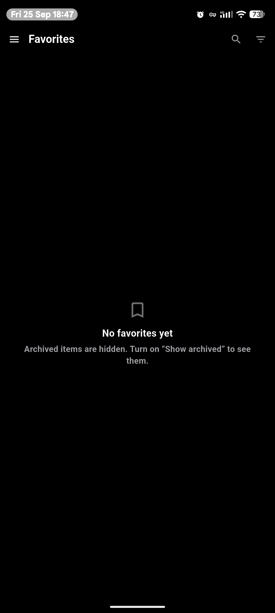
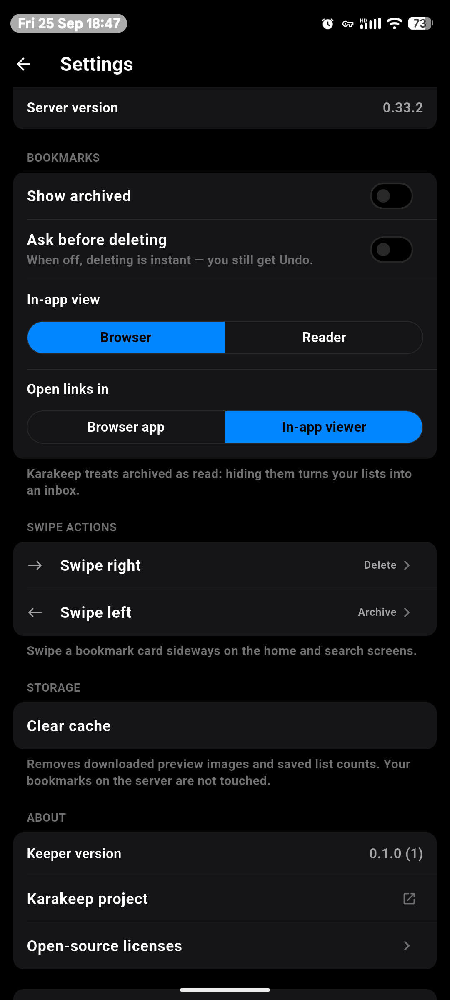

# Linkstow

**An open-source mobile client for [Karakeep](https://github.com/karakeep-app/karakeep)** —
the self-hostable "bookmark everything" app. Sign in to your own server (or
Karakeep Cloud) and read, sort and clean up your bookmarks from your phone.

> Linkstow is an independent, community project. It is **not affiliated with or
> endorsed by Karakeep** or Localhost Labs Ltd. "Karakeep" is used here only
> to say what the app works with.

<p align="center">
  
  &nbsp;&nbsp;
  
</p>

## Features

**Connect**
- Any Karakeep server: self-hosted (LAN `http://`, private CAs) or Karakeep Cloud
- Checks the server before sign-in and shows its version
- Email + password, or an API key — the way in for SSO-only servers
- Custom request headers for servers behind Cloudflare Access, Authelia or
  another auth proxy
- The password is never stored: it's exchanged for an API key kept in the
  platform's secure storage

**Browse**
- Link-preview cards with image, title, description, site, every tag and date
- Drawer with All / Favorites / Archived, your lists (nested, smart lists
  marked) and tags
- `unarchived / total` count on every list — Karakeep treats archived as
  read, so this is your unread count
- "Show archived" filter, remembered along with the last opened list
- Search with Karakeep's query language, limited to the open list or tag,
  with tappable syntax examples
- Create lists (manual or smart, nested) and tags from the drawer

**Read**
- In-app viewer: the live page or Karakeep's saved **Reader** article
- Swipe left/right for the next/previous bookmark
- Toolbar: lists, favorite, share, open in browser, archive, delete, tags,
  copy link
- Archiving while archived items are hidden moves straight to the next one

**Act fast**
- Swipe actions on cards — pick what right and left swipes do: favorite,
  archive, add to list, add tag, delete
- Undo on every action; deletes are only sent to the server once the Undo
  window has passed
- Optional "Ask before deleting"

## Requirements

- A Karakeep server. Developed against **0.33.x**.
- Android. iOS builds from the same code but hasn't been tested on a device
  yet.

## Getting started

1. Enter your server address — `keep.example.com`, `http://192.168.1.20:3000`,
   or tap **Karakeep Cloud**. Add custom headers under **Advanced** if a proxy
   sits in front of it.
2. Sign in with **Email & password**, or switch to **API key** and paste a key
   from Karakeep's web UI → Settings → API Keys (needed if you sign in with
   SSO).

Signing out removes the key from the phone. Karakeep doesn't let an API key
revoke itself, so revoke it on the web if you no longer need it.

## Building from source

Linkstow is Flutter (Dart) with Riverpod and uses the `material_ui` package, which
currently needs Flutter's **master** channel (developed on 3.49 / Dart 3.14).

```sh
cd apps/flutter
flutter pub get
flutter run                # on a connected device
flutter test               # unit + widget tests
flutter build apk --release
```

The launcher icon is drawn by a script, then turned into platform icons:

```sh
python3 tool/generate_app_icon.py
dart run flutter_launcher_icons
```

## How it's built

- **Architecture:** MVVM in three layers — `data`, `domain`, `presentation` —
  per feature under `apps/flutter/lib/features/` (`auth`, `bookmarks`,
  `settings`), with shared pieces in `lib/core/`. See
  [`docs/architecture/`](docs/architecture/README.md) and the decision record
  [`docs/adr/0001`](docs/adr/0001-flutter-riverpod-rest-auth.md).
- **Karakeep API:** the public REST API (`/api/v1`) wherever it's enough. The
  internal tRPC API is used only where REST has no equivalent: password
  sign-in, server feature flags, list/tag feeds with the archive filter, and
  list counts. Details and findings are in
  [`docs/research/karakeep-server.md`](docs/research/karakeep-server.md).

```
apps/flutter/     the app
docs/             architecture, ADRs, research notes, screenshots
design/           design tokens and source assets
scripts/verify.sh one entry point for CI and local checks
```

## Roadmap

Ideas, roughly in order: save from the Android share sheet, highlights,
editing notes and titles, offline reading, multiple accounts, RSS feed
management, and a light theme.

## Contributing

Issues and pull requests are welcome. Please run `flutter analyze` and
`flutter test` in `apps/flutter` before opening a PR.

## License

[GPL-3.0](LICENSE). You may use, study, share and change Linkstow; if you
distribute a modified version, its source must be available under the same
license.

"Karakeep" is the name of the project Linkstow connects to and belongs to its
owners; Linkstow's own name and icon are separate.
